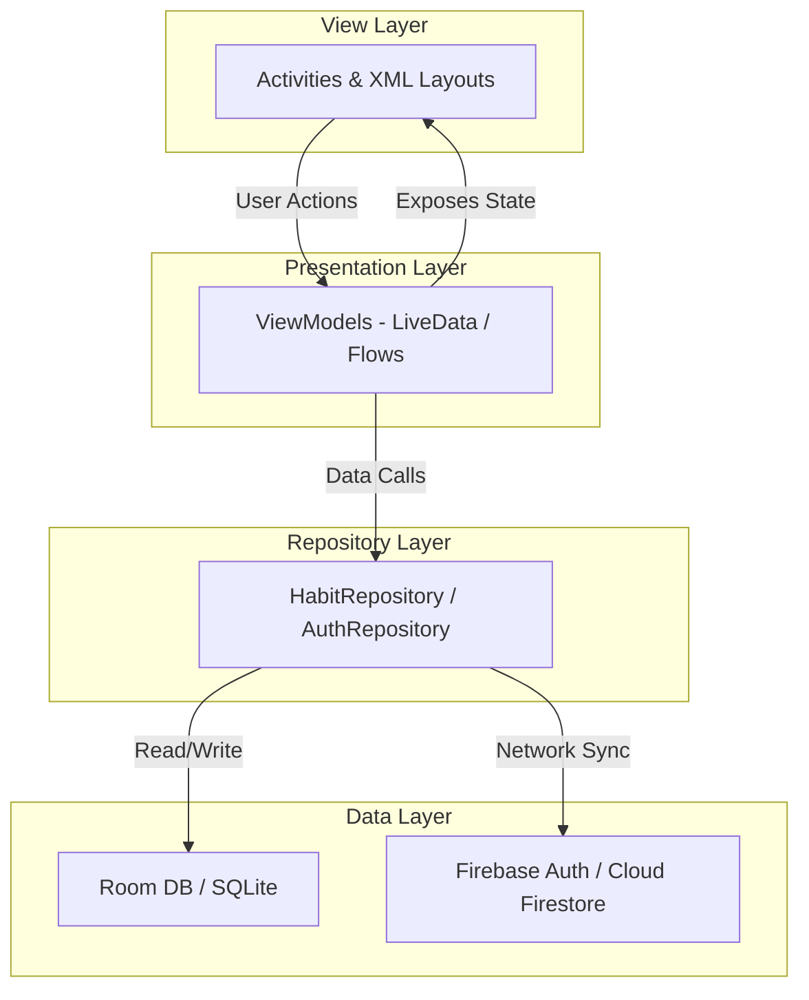

# Health Habit Tracker 💧🏃‍♂️😴

[](https://developer.android.com/)
[](https://kotlinlang.org/)
[](https://firebase.google.com/)
[](https://developer.android.com/training/data-storage/room)
[](https://developer.android.com/topic/libraries/architecture)

Health Habit Tracker is a modern, premium, offline-first Android application designed to help users build and sustain healthy daily habits. Built using Kotlin and following the MVVM architecture pattern, the app integrates local database persistence, cloud synchronization, scheduling, and rule-based insights to keep users motivated and on track.

---

## ✨ Features

### 🔐 User & Authentication
- **User Registration**: Secure account creation with email verification inputs.
- **User Login**: Easy login with validation alerts for passwords and malformed emails.
- **Firebase Authentication**: Backend user validation and secure sessions.
- **Forgot Password**: Password reset email recovery system.

### 📅 Habit Management
- **Habit Creation & Categories**: Create habits with goals and reminder times across pre-defined categories (*Water, Exercise, Sleep, Study, Meditation, Custom*).
- **Edit & Delete Habits**: Seamlessly update goals, notes, or reminder toggles, and delete habits with safety dialog confirmations.
- **Daily Habit Tracking & Completion**: Track daily completion status with intuitive checkoff checkboxes.

### 📊 Reports & Insights
- **Progress Reports**: Visual stats dashboard.
- **Weekly & Monthly Analytics**: Charting of completion rates and weekday performances utilizing **MPAndroidChart**.
- **AI Health Insights**: Rule-based engine calculating strengths, current streaks, and recommendation tips.

### 🛠️ Utilities & Preferences
- **Notifications & Habit Reminders**: WorkManager-scheduled alarms that trigger local push notifications at the exact user-specified time.
- **User Profile**: Display account details and trigger password updates or sign-outs.
- **Settings & Dark Mode**: System-wide theme preferences persisted using Android Jetpack DataStore.

### 🔄 Sync & Persistence
- **Room Database Storage**: Pre-populates starter habits and provides responsive offline storage.
- **Firebase Firestore Cloud Sync**: Automatic sync when authenticated to ensure habit records are backed up securely.

---

## 📸 Screenshots

| Login & Authentication | Dashboard & Statistics | Add/Edit Habit |
| :---: | :---: | :---: |
| _[Placeholder: Login Screen]_ | _[Placeholder: Dashboard]_ | _[Placeholder: Add Habit]_ |
| _[Placeholder: Register Screen]_ | _[Placeholder: Reports & Analytics]_ | _[Placeholder: Settings]_ |
| _[Placeholder: Profile]_ | _[Placeholder: AI Insights]_ | |

---

## 🛠️ Tech Stack

- **Programming Language**: Kotlin
- **Architecture**: MVVM (Model-View-ViewModel)
- **Local Persistence**: Room SQLite Database & DataStore Preferences
- **Cloud Backend**: Firebase Authentication & Cloud Firestore Database
- **Task Scheduling**: Jetpack WorkManager
- **Libraries**:
  - Material Design 3 UI Components
  - AndroidX Core & Lifecycle KTX
  - MPAndroidChart (Data Visualization)
  - Kotlin Coroutines & Flow (Asynchronous streams)
  - Jetpack ViewModel & LiveData

---

## 🏛️ Project Architecture

The app follows the official **MVVM (Model-View-ViewModel)** architectural recommendations. Views observe LiveData streams exposed by ViewModels, which query the Repository to coordinate local SQLite database operations and remote Firestore synchronization.



---

## 📁 Folder Structure

- **`app`**: Main Android module housing build configs, manifests, and assets.
- **`com.example.habittracker` (Activities)**: Presentation layer screens (`MainActivity`, `LoginActivity`, `AddHabitActivity`, `ReportsActivity`, etc.).
- **`data`**: Room Database entities, queries (DAOs), repository mediators, and preferences (DataStore).
- **`repository`**: Firestore API integration layer mapping networks.
- **`model`**: Data transfer objects (DTOs) for cloud exchange and insights entities.
- **`viewmodel`**: Directs view requests, schedules threads via coroutines, and exposes LiveData.
- **`util` (Utils)**: WorkManager scheduling helpers, notification builders, and rule engines.

---

## ⚙️ Installation Guide

Follow these steps to set up and run the project locally:

1. **Clone the Repository**:
   ```bash
   git clone https://github.com/Mahathi-K/health-habit-tracker.git
   cd health-habit-tracker
   ```
2. **Open Android Studio**:
   - Select **Open an Existing Project** and choose the `health-habit-tracker` root directory.
3. **Sync Gradle**:
   - Allow Android Studio to download dependencies and sync the build project files.
4. **Add google-services.json**:
   - Place your downloaded `google-services.json` config inside the `app/` directory (see Firebase Setup below).
5. **Run the Project**:
   - Connect an emulator or android device and run the project (`Shift + F10` or click **Run**).

---

## 🔥 Firebase Setup

1. Go to the [Firebase Console](https://console.firebase.google.com/) and click **Add Project**.
2. Register an Android Application using the package ID `com.example.habittracker`.
3. Download the `google-services.json` file and copy it into the `app/` folder of your project workspace.
4. Enable **Email/Password sign-in** inside the Authentication settings.
5. Create a **Cloud Firestore Database** in Test Mode or update Rules to allow authenticated access under `/users/{userId}`.

---

## 🚀 Future Improvements

- **Google Sign-In**: Streamlined authentication flow.
- **Health Connect Integration**: Sync steps, active time, and sleep metrics directly from Google Health Connect APIs.
- **Wear OS Support**: Complete habits directly from smartwatches.
- **Cloud Backup**: Enhanced archive and restore features.
- **Habit Sharing**: Social sharing feeds and buddy challenge invites.
- **Calendar Integration**: Visual monthly calendar views mapped to system calendars.
- **AI-Powered Recommendations**: Machine learning recommendation engines offering habits suggestions.

---

## 👤 Author

**Mahathi Kanneboina**
- GitHub: [@Mahathi-K](https://github.com/Mahathi-K)

---

## 📄 License

This project is licensed under the MIT License. See the [LICENSE](LICENSE) file for more information.

---

## 🤝 Support & Feedback

If you find this project helpful or interesting, please consider giving it a ⭐ **star** on GitHub!