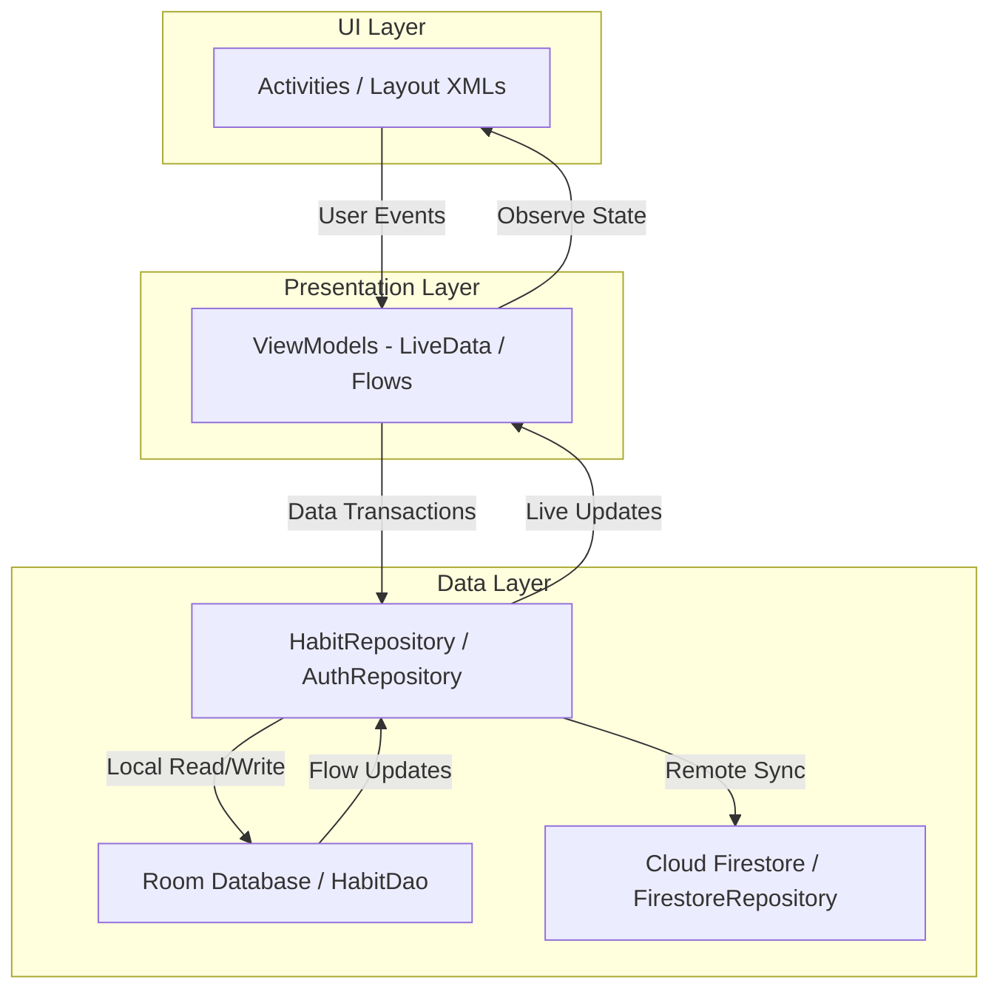
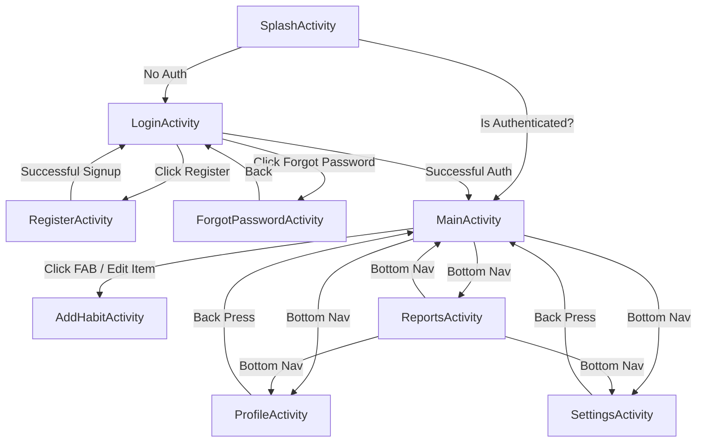
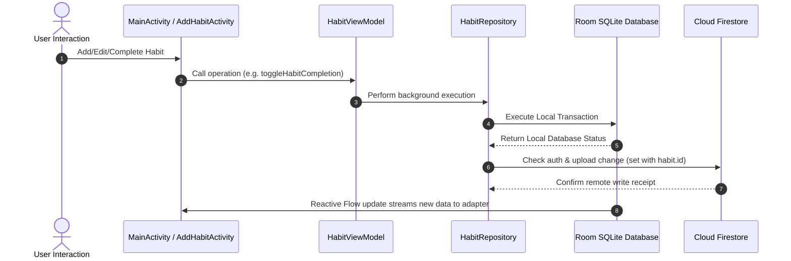

# System Architecture and App Flow Documentation

This document explains the architecture design, package structures, core classes, and system flows of the Health Habit Tracker application.

---

## 🏛️ MVVM Architectural Flow

The application follows the clean architectural pattern of Model-View-ViewModel (MVVM). Communication flows one-way from the View (UI) to the ViewModel, down to the repository and database layers, and reactive updates flow back to the UI via LiveData streams and Kotlin Flows.

---

## 🗺️ App Navigation Flow

The navigation workflow represents how users journey through authentication and primary pages.

---

## 🔄 Room Database & Cloud Firestore Sync Flow

Data is cached locally first. Offline mutations are synced to Firestore when an internet connection/auth state is verified, matching user accounts.

---

## 📦 Package & Class Guide

### Package: `com.example.habittracker`
- **`SplashActivity`**: First screen. Decides whether to direct the user to authentication or straight to the home dashboard.
- **`LoginActivity`**: Processes sign-in actions, validates user credentials, and directs to signup or password recovery.
- **`RegisterActivity`**: Manages sign-up workflow.
- **`ForgotPasswordActivity`**: Requests recovery emails for user accounts.
- **`MainActivity`**: Dashboard listing active habits, circular stats progress, and AI insights.
- **`ReportsActivity`**: Generates bar charts and pie charts of habit metrics.
- **`SettingsActivity`**: Persists preferences like dark mode and alerts.
- **`ProfileActivity`**: Manages current user display names, credentials, and sign-outs.
- **`AddHabitActivity`**: Screen to add or update habits.

### Package: `com.example.habittracker.data`
- **`Habit`**: Room entity class representing individual habits.
- **`HabitDao`**: Query interface implementing standard SQLite statements.
- **`HabitDatabase`**: SQLite database wrapper. Uses a callback to populate initial starter habits.
- **`HabitRepository`**: Coordinates local Room writes and Firestore remote replication.
- **`SettingsRepository`**: Interacts with Android Jetpack DataStore to store system toggles.

### Package: `com.example.habittracker.repository`
- **`FirestoreRepository`**: Low-level network handler for Firebase Cloud Firestore operations.

### Package: `com.example.habittracker.util`
- **`InsightGenerator`**: Evaluates active habits and returns rule-based recommendations.
- **`NotificationHelper`**: Builds push reminders and performs API level checks.
- **`WorkManagerUtil`**: Handles scheduling logic for recurring alarms.
